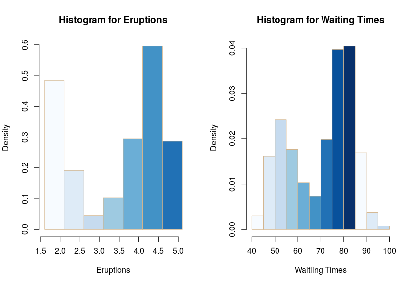
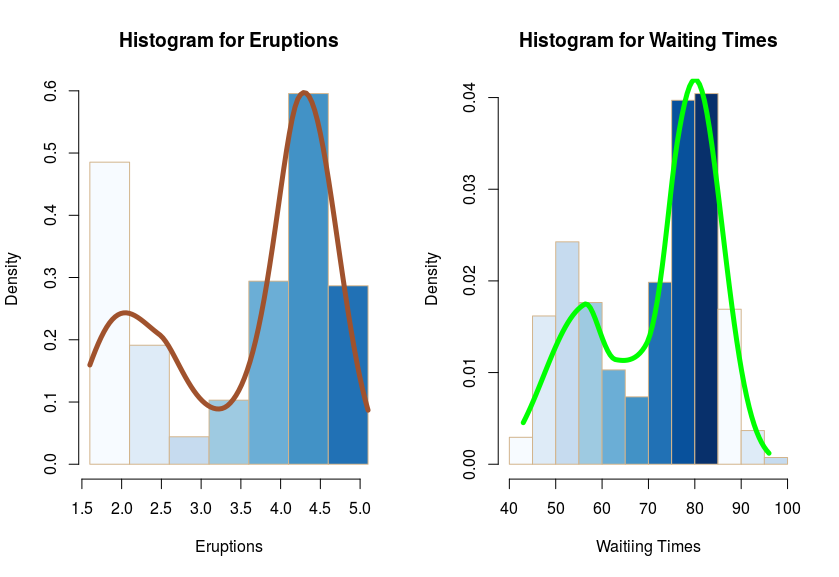
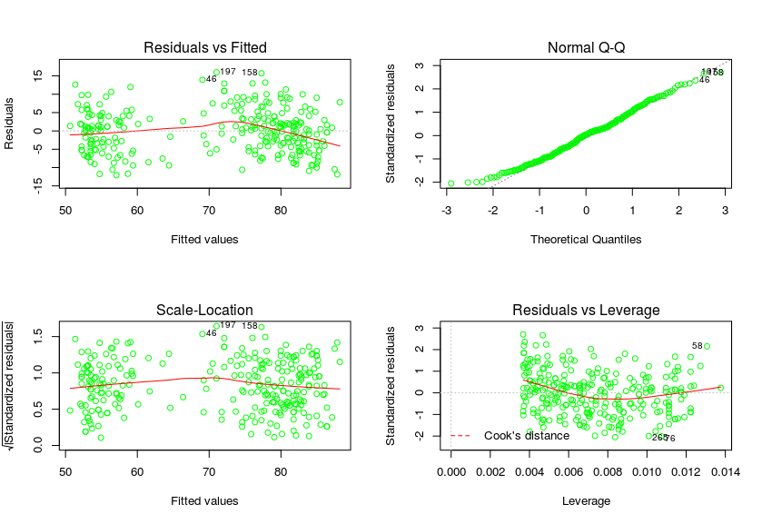
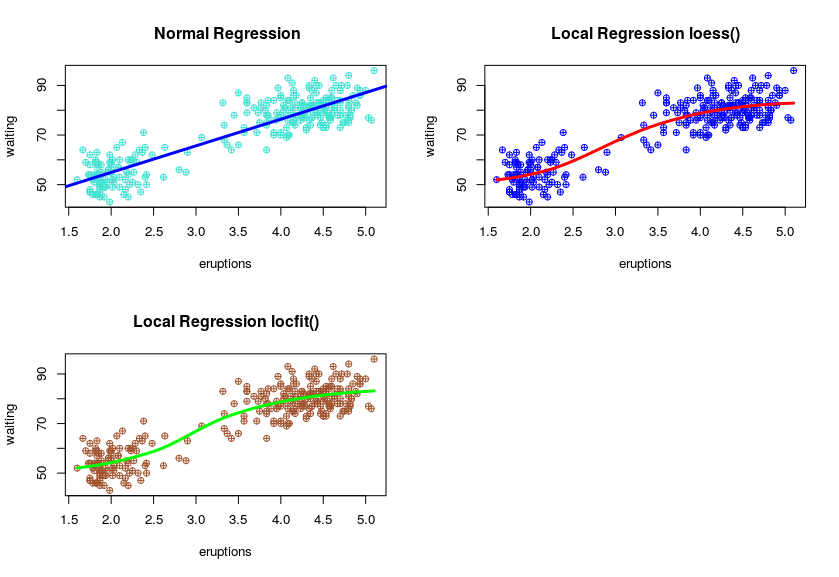

```{r setup, include=FALSE}
knitr::opts_chunk$set(echo = TRUE)
```
\begin{center}
\includegraphics[width=0.5\textwidth]{../R_logo.png}\par\vspace{1cm}
\vspace{1cm}
	{\huge\bfseries RBrownBag Nr. 3 Exploratory Data Analysis\par}
\vspace{1.5cm}
	{\huge\bfseries Old Faithful\par}
\vspace{2cm}
	{\Large\itshape Gary R. Seamans\par}
\vspace{2cm}
\thispagestyle{empty}
\newpage
\pagenumbering{roman}
\maketitle
\tableofcontents
\newpage
\listoffigures
\listoftables
\newpage
\end{center}
\pagenumbering{arabic}

# Problem Description

Complete the following using the Old Faithful geyser dataset:

- Produce density histograms of eruption times and of waiting times.
- Produce a smoothed density histogram from local polynomial regression.
- Discuss each step of the R code to show eruption times and waiting times.
- Discuss the results of the local polynomial regression.
- In your discussion, compare local polynomial regression to regular regression.

# Introduction and Setup
This example was written in RMarkdown and includes LaTex commands. 

For this example I used the Old Faithful geyser dataset located under RDatasets/csv/datasets/faithful.csv. Each step of the R processing is described. 

@tukey_exploratory_1977 described a method for perfroming local regression which became *LOWESS*. *LOESS* is an extension of *LOWESS* for local polynomial regression [@cleveland_computational_1991]. Locfit is an R package that can be used to perform local regression and smoothing. Locfit can use fixed, nearest-neighbor, and locally adaptive schemes [@loader_locfit:_1997]. Both *locfit* and *LOESS* were used for peforming local polynomial regression on the Old Faithful dataset.


# Read in the faithful.csv dataset

```{r, eval=FALSE}
# Read in the dataset skipping the index column
geysers <- read.csv("faithful.csv", colClasses = c("NULL", NA, NA))
```
# Old Faithful Data a Quick Look

In this section I take a quick exploratory look at the Old Faithful dataset. The data is examined to determine and, if necessary, modify the data types. A quick look at the summary statistics is also performed. The purpose is to get a *feel* for the data that is being analyzed.

## Faithful Data
The Old Faithful data has two variables. I'll use the **str()** function to examine their types.

```{r, eval=FALSE}
str(geysers)
```
**'data.frame':	272 obs. of  2 variables:**

 - eruptions: num  3.6 1.8 3.33 2.28 4.53 ...
 - waiting  : int  79 54 74 62 85 55 88 85 51 85 ...

Both *eruptions* and *waiting* are numeric types. Eruptions is the *eruption* duration time in minutes and *waiting* is the time until the next eruption, also in minutes.
\newpage

## First Five Rows & Summary Data

The following commands were used to generate tables for the first five rows of the *Old Faithful* dataset and a summary of the data.

```{r,eval=FALSE}
print(xtable(head(geysers,5),caption = "Geysers First Five Rows",  format = "latex"), 
      include.rownames = FALSE )
print(xtable(summary(geysers),caption = "Geysers Summary",  format = "latex"), 
      include.rownames = FALSE )
```

\begin{table}[htb]
\caption{Geysers First Five Rows} 
\vspace{0.2 cm}
\centering
\begin{tabular}{rr}
  \hline
eruptions & waiting \\ 
  \hline
3.60 &  79 \\ 
  1.80 &  54 \\ 
  3.33 &  74 \\ 
  2.28 &  62 \\ 
  4.53 &  85 \\ 
   \hline
\end{tabular}
\end{table}
\vspace{0.5 cm}
\begin{table}[htb]
\caption{Geysers Summary Data} 
\vspace{0.2 cm}
\centering
\begin{tabular}{ll}
  \hline
  eruptions &    waiting \\ 
  \hline
Min.   :1.600   & Min.   :43.0   \\ 
  1st Qu.:2.163   & 1st Qu.:58.0   \\ 
  Median :4.000   & Median :76.0   \\ 
  Mean   :3.488   & Mean   :70.9   \\ 
  3rd Qu.:4.454   & 3rd Qu.:82.0   \\ 
  Max.   :5.100   & Max.   :96.0   \\ 
\hline
\end{tabular}
\end{table}

# Probability Density Histograms

Eruptions are floating point numbers between 1.6 and 5.1. To make the eruptions histogram more accurate the break points where changed to reflect the these numbers using a step of 0.5 between breaks.

First a set of normal density histograms are created and then the same set has local regression lines added to the graphs.

## Normal Density Histograms

The following *R* commands were used to generate the density histograms:
```{r, eval=FALSE}
# Set the display to show two side-by-side density histograms
par(mfrow = c(1,2))
# Create a sequence to step the X-axis by 0.5 for eruptions
b <- seq(min(geysers$eruptions),max(geysers$eruptions), by = 0.5)
# Create the eruptions density histogram
hist(geysers$eruptions, freq = FALSE, main="Histogram for Eruptions", 
     xlab = "Eruptions", border = "tan", col = blues9, breaks = b)
# Create the waiting density histogram
hist(geysers$waiting, freq = FALSE, main="Histogram for Waiting Times", 
     xlab = "Waiting Times", border = "tan", col=blues9)
```


Examining the graphs there appears to be a pattern were the longer the *eruption* the greater the *waiting* time before the next eruption. In the next section we'll use local regression help visualize this pattern.

\newpage

## Smoothed Density Histograms

For this I used the **locfit** library to perform local regression on the density histograms for *eruptions* and *waiting* times. The *~lp* specifies that this is density estimation model.

```{r, eval=FALSE}
par(mfrow = c(1,2))
b <- seq(min(geysers$eruptions),max(geysers$eruptions), by = 0.5)
hist(geysers$eruptions, freq = FALSE, main="Histogram for Eruptions", 
     xlab = "Eruptions", border = "tan", col = blues9, breaks = b)
gfite <- locfit(~lp(eruptions), data=geysers)
lines(gfite, col="sienna", lwd=5)
hist(geysers$waiting, freq = FALSE, main="Histogram for Waiting Times", 
     xlab = "Waitiing Times", border = "tan", col=blues9)
gfitw <- locfit(~lp(waiting), data=geysers)
lines(gfitw, col="green", lwd=5)
```


The smoothed density histograms are very similar between the waiting times and eruptions. This seems to show a significant correlation between eruption duration and waiting times. Bascially the longer the eruption the greater the waiting time before the next eruption.

\newpage

# Comparing Local to Linear Regression

For the first part of this comparison I looked at the assumptions for a linear model of the *waiting* time versus the *eruptions*. In the next part the regression plots are examined by adding an abline and local regression lines using *locfit* and *LOESS*.

```{r, eval=FALSE}
# Set up a 2x2 matrix to display the results
par(mfrow=c(2,2))
# Plot the linear regression
plot(lm(geysers$waiting ~ geysers$eruptions), col="green")
```


Looking at the assumptions we can see that in the **Residuals vs Fitted** graph the plots are not randomly distributed around the **0.0** line but clustered in the 50-60 and 70-80 range. In the **Scale-Location** graph a similar clustering and displacement can be observed. So the assumptions of linearity and homoscedasticity are rejected. We have to assume that the distribution is not Gaussian. 
\newpage

## Normal Linear Regression with Standard Fit

Following are the R commands to plot the regression and draw an abline:
```{r, eval=FALSE}
# Setup a 2x2 matrix to hold the graphs
par(mfrow = c(2,2))
# Plot the regression and add an abline
gfitLM <- lm(waiting ~ eruptions, data = geysers)
plot(waiting ~ eruptions,  main = " Normal Regression", data = geysers, 
     pch=10, cex=1, col="turquoise")
abline(gfitLM, col="blue", lwd=3)
```

## Local Regression using loess()

Following are the R commands to plot the regression and add a regression line using *LOESS*:
```{r, eval=FALSE}
# Plot the regression and ad a local regression line using loess()
plot(waiting ~ eruptions, main = "Local Regression loess()", 
     data = geysers, pch=10, cex=1, col="blue")
xfitLoess <- loess(waiting ~ eruptions, data = geysers)
dorder <- order(geysers$eruptions)
lines(faithful$eruptions[dorder], xfit$fitted[dorder], col="red", lwd=3)
```
## Local Regression using locfit()

Following are the R commands to plot the regression and add a regression line using *locfit*:
```{r, eval=FALSE}
# Plot the regression and ad a local regression line using locfit()
plot(waiting ~ eruptions, main = "Local Regression locfit()", data = geysers, 
     pch=10, cex=1, col="sienna")
xfitLocfit <- locfit(waiting ~ lp(eruptions), data=geysers)
lines(xfitLocfit, col="green", lwd=3)
```

\newpage

Examining the plots it is easy to see how the local regression lines follow the density of the plots while the normal, abline, plot doesn not.



# Spearman's Correlation
Since we've determined that the distribution is not Gaussian, but there does appear to be a correlation between the length of the eruption and the waiting time before the next eruption we'll check that using Spearman's correlation. Spearman's correlation ensures the monotonic relationship of the variables rather than the linear association and is more accurate than using Person's correlation. 

```{r, eval=FALSE}
eruptionVec <- as.vector(geysers$eruptions)
waitingVec <- as.vector(geysers$waiting)
cor.test(eruptionVec,waitingVec, method = 'spearman')
Spearmans rank correlation rho
 data:  eruptionVec and waitingVec
 S = 744660 
 p-value < 2.2e-16
 alternative hypothesis: true rho is not equal to 0
 sample estimates: rho  0.7779721 
```
With a *rho* of 78% it seems reasonable to assume a correlation, increasing, between the length of an eruption and the waiting time before the next eruption.

\begin{center}
\title{References}
\maketitle
\end{center}
\bibliographystyle{apalike2}
\bibliography{library}